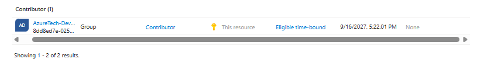
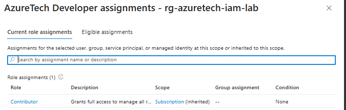
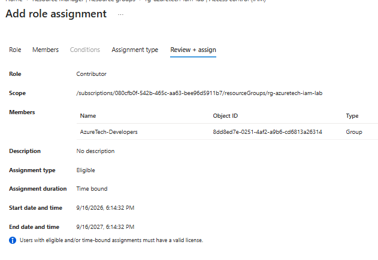
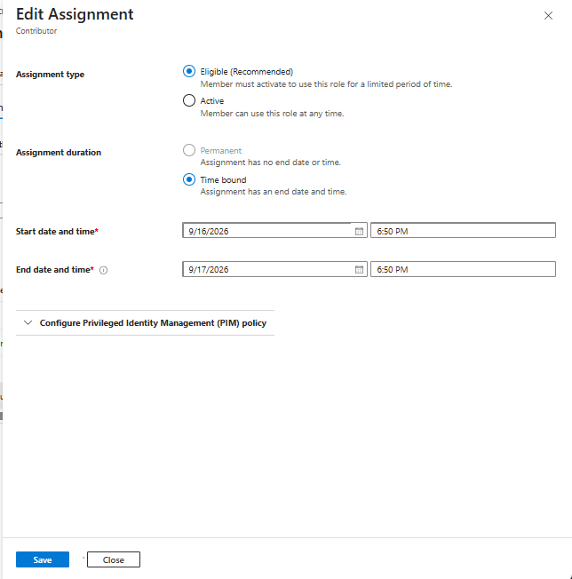
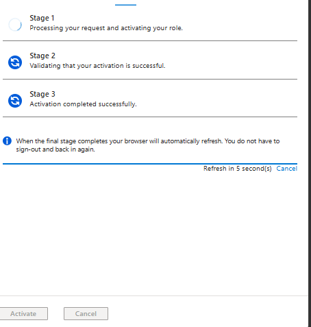
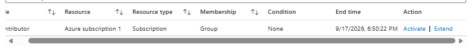
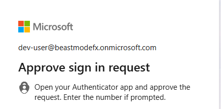
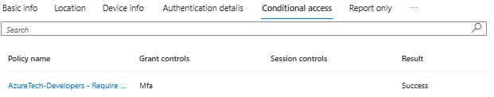

# AzureTech — Enterprise IAM & Least-Privilege Lab

## Project Overview

AzureTech is a fictional company using Microsoft Azure.

This project focuses on Identity and Access Management (IAM) and the implementation of least-privilege access.

The goal is to design, implement, test, intentionally misconfigure, investigate, remediate, and validate access controls within Azure.

## Project Focus

* Microsoft Entra ID
* Identity management
* Groups
* Authentication
* Multi-Factor Authentication (MFA)
* Conditional Access
* Azure RBAC
* Least privilege
* Privileged Identity Management (PIM)
* Access testing

## Project Methodology

```text
Design
   ↓
Build
   ↓
Test
   ↓
Break
   ↓
Investigate
   ↓
Fix
   ↓
Validate
   ↓
Document
```

## Status

🟡 Project initialization

## IAM Design

### Teams

- AzureTech-Developers
- AzureTech-Security
- AzureTech-Cloud-Admins

### Lab Users

- dev-user
- security-user
- cloud-admin

### IAM Principle

Permissions will be assigned primarily through Entra ID groups rather than directly to individual users.

The project will demonstrate least privilege by intentionally introducing excessive permissions, investigating the access, remediating the configuration, and validating the result.

## RBAC Access Model

AzureTech will use Azure Role-Based Access Control (RBAC) to control access to Azure resources.

Access will be assigned primarily to Entra ID groups rather than individual users.

### Planned Access Model

| Group                  | Intended Access                      | Scope           |
| ---------------------- | ------------------------------------ | --------------- |
| AzureTech-Developers   | Limited resource management          | Resource Group  |
| AzureTech-Security     | Security and identity administration | Selected scopes |
| AzureTech-Cloud-Admins | Privileged Azure administration      | Subscription    |

### Least-Privilege Test

The lab will intentionally introduce an excessive permission:

`AzureTech-Developers → Contributor → Subscription`

This configuration will be investigated and remediated.

The investigation will examine:

* Who received the permission
* Which role was assigned
* The scope of the assignment
* Why the access is excessive
* What the appropriate scope should be

The final configuration will be validated through access testing.

## RBAC Misconfiguration and Remediation

### Initial Configuration

The `AzureTech-Developers` group was intentionally assigned the **Contributor** role at the **subscription scope**.

```text
AzureTech-Developers
        ↓
    Contributor
        ↓
   Subscription
```

This configuration was intentionally introduced to simulate excessive permissions in an enterprise environment.

### Access Test

The `dev-user` account was added to the `AzureTech-Developers` group.

After signing in as `dev-user`, the account was able to access the Azure subscription and the `rg-azuretech-iam-lab` resource group.

The effective access was confirmed through Azure IAM:

```text
dev-user
   ↓
AzureTech-Developers
   ↓
Contributor
   ↓
Subscription
```

### Investigation

The investigation identified that the excessive access was not assigned directly to `dev-user`.

The permission was inherited through the user's Entra ID group membership.

The root cause was:

> The `AzureTech-Developers` group had been assigned the Contributor role at subscription scope instead of being restricted to the resource group required for development activities.

### Remediation

The subscription-level Contributor assignment was removed.

A new Contributor assignment was then created at the resource-group scope:

```text
AzureTech-Developers
        ↓
    Contributor
        ↓
rg-azuretech-iam-lab
```

This reduces the scope of the Developer group's permissions while maintaining the access required for the lab resource group.

### Evidence

#### RBAC Before Remediation



The screenshot demonstrates Contributor assigned to `AzureTech-Developers` at subscription scope.

#### Developer Effective Access



The screenshot demonstrates that `dev-user` inherited Contributor access through the `AzureTech-Developers` group.

#### RBAC After Remediation



The screenshot demonstrates the corrected Contributor assignment at the `rg-azuretech-iam-lab` resource-group scope.

### Security Lesson

The role assigned to an identity is only part of an authorization decision.

The **scope** of the role is equally important.

A Contributor assignment at subscription scope provides substantially broader access than the same role assigned to a single resource group.

This lab demonstrates the principle of reducing permissions to the smallest practical scope required for a user's role.

## Privileged Identity Management (PIM)

AzureTech uses Microsoft Entra Privileged Identity Management (PIM) to reduce standing privileged access.

### Initial Privileged Access

The `cloud-admin` account was initially assigned the Contributor role at subscription scope as a demonstration of standing privileged access.

```text
cloud-admin
     ↓
Contributor
     ↓
Subscription
     ↓
Permanent / Active
```

This configuration was then replaced with a PIM-managed assignment.

### PIM Configuration

The `cloud-admin` account was configured as **Eligible** for the Contributor role at subscription scope.

```text
cloud-admin
     ↓
PIM
     ↓
Contributor
     ↓
Subscription
     ↓
Eligible
```

The PIM policy was configured to require additional controls during activation:

* Multi-factor authentication
* Activation justification
* Time-limited activation

The lab activation period was configured for approximately one hour.

### Privileged Access Workflow

```text
Eligible
   ↓
Activation request
   ↓
MFA
   ↓
Justification
   ↓
Temporary Contributor access
   ↓
Expiration
   ↓
Privilege no longer active
```

### Security Objective

The purpose of this configuration is to demonstrate Just-In-Time privileged access.

Instead of allowing an administrator to continuously hold a powerful Azure role, the privilege is made available only when required and for a limited period.

### Evidence

#### Permanent Access Before PIM


This demonstrates the initial standing Contributor assignment.

#### PIM Eligible Assignment



This demonstrates the transition to PIM-managed eligible access.

#### PIM Activation



This demonstrates temporary activation of the privileged role.

#### PIM Policy



This demonstrates the activation controls configured for the privileged role.

## Conditional Access

AzureTech uses Microsoft Entra Conditional Access to enforce additional authentication requirements during sign-in.

A policy was created for the `AzureTech-Developers` group:

```text
AzureTech-Developers
        ↓
Conditional Access
        ↓
Require MFA
```

### Policy Configuration

**Policy:** `AzureTech-Developers - Require MFA`

**Users / Groups:**

* AzureTech-Developers

**Target resources:**

* All cloud apps

**Access control:**

* Require multifactor authentication

The policy was intentionally limited to the Developer group so that the lab administrator account was not affected.

### Validation

The `dev-user` account was used to test the policy.

During sign-in, Conditional Access required MFA before access was granted.

The resulting sign-in event was then reviewed in Microsoft Entra sign-in logs to verify that the Conditional Access policy was successfully evaluated.

### Evidence

#### Conditional Access MFA Test



#### Conditional Access Validation



### Security Lesson

Conditional Access and Azure RBAC solve different parts of the access-control problem.

Conditional Access determines whether a sign-in satisfies the organization's authentication and access requirements.

Azure RBAC determines what an authenticated identity is authorized to do within Azure resources.

Together they provide layered access control:

```text
Identity
   ↓
Conditional Access
   ↓
Authentication requirements
   ↓
Azure RBAC
   ↓
Resource authorization
```

